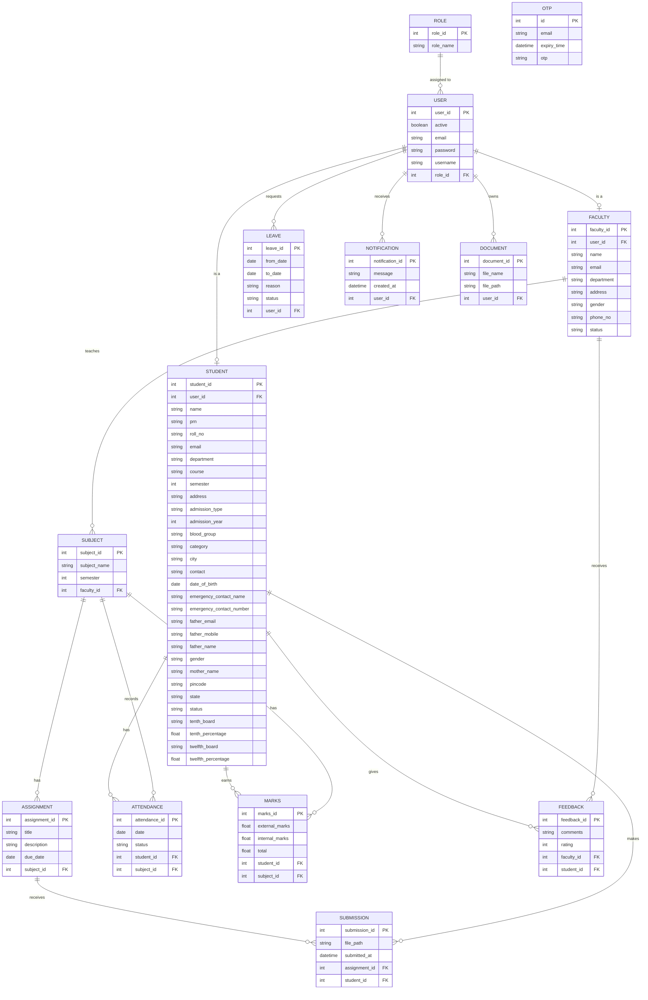
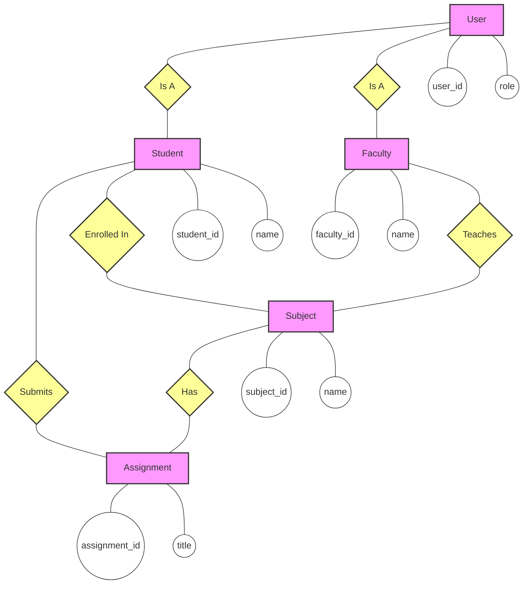

# Entity Relationship Diagrams

## 1. Detailed Schema (Crow's Foot Notation)
This diagram shows all tables, columns, and foreign key relationships.

## 2. Conceptual Diagram (Chen's Notation)
This diagram uses Rectangles (Entities), Diamonds (Relationships), and Circles (Attributes - key ones shown).

